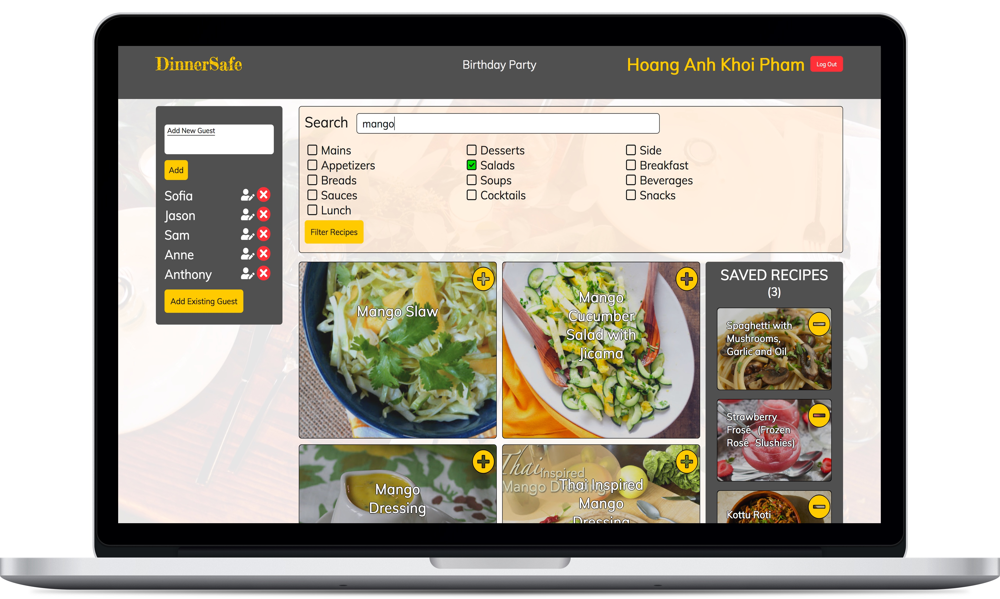

# DinnerSafe
*DinnerSafe* is a web application that allows users to find recipes that respect all guests' dietary restrictions at events.

Users can edit events, guests as well as save recipes. The application stores user information in Firebase and allows users to authenticate and access their specific events, saved recipes and guests.

Recipes are obtained from the Yummly API and can be filtered by the user through a search query or by selecting specific courses.

## Live Link
NOTE: as of September 2019, the **Yummly API is offline**. As such, this appplication is unfortunately no longer functional.

## Screenshot

